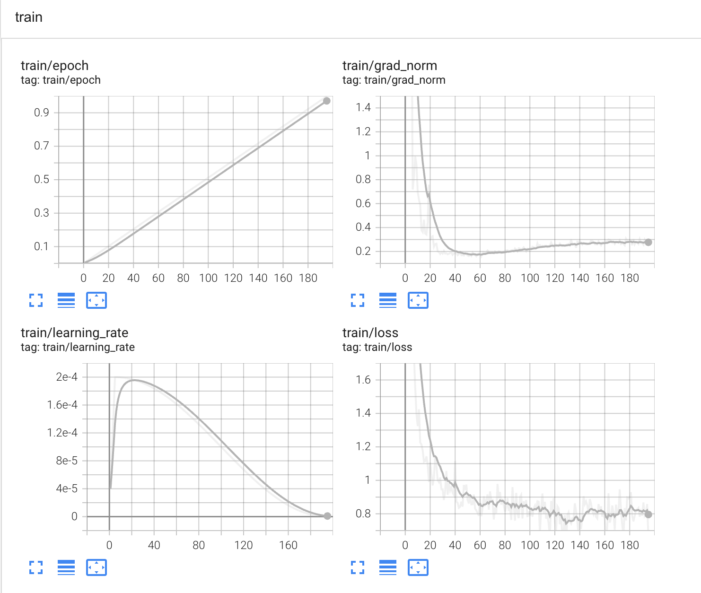
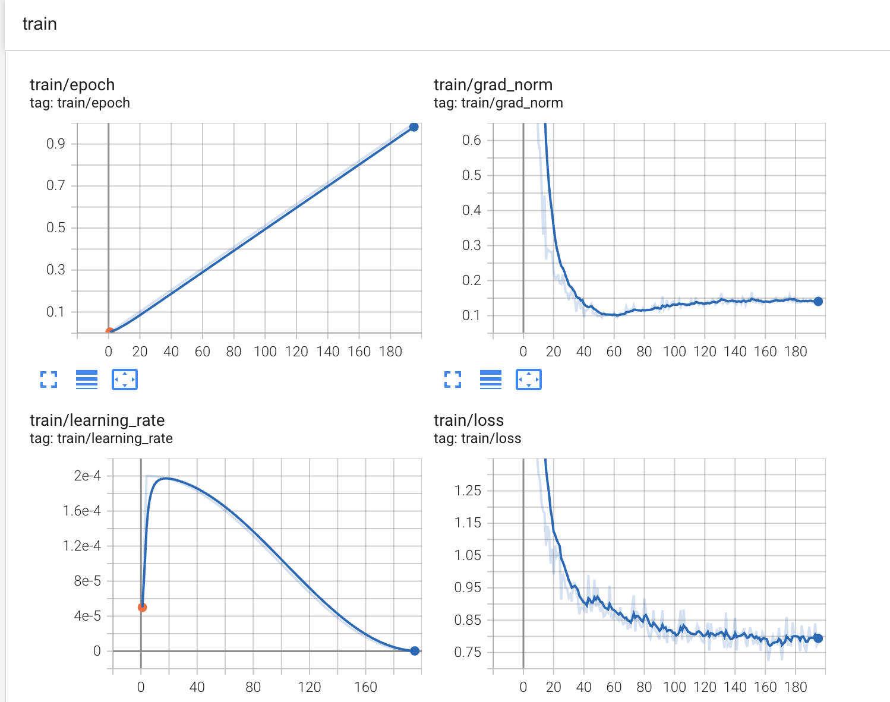

<p align="center">
    
</p>

# Hyper-Sloth

A high-performance framework for fine-tuning large language models, built on top of **Unsloth** and **HuggingFace Transformers**.

> **🚀 Everything Unsloth supports + Multi-GPU distributed training**

## Performance Benchmarks

HyperSloth demonstrates significant performance improvements over other popular fine-tuning frameworks, powered by NCCL's optimized communication backend.

### Training Time Comparison (4x RTX 4090)

| Framework                  | Training Time | VRAM Peak Consumption | Communication Backend |
| -------------------------- | ------------- | --------------------- | --------------------- |
| HyperSloth (NCCL) (4GPUS)  | 19 minutes    | 6 GB                  | NCCL                  |
| HyperSloth (Legacy)(4GPUS) | ~21 minutes   | 6 GB                  | Memory-mapped files   |
| LlamaFactory               | 30 minutes    | 21 GB                 | PyTorch DDP           |
| Unsloth (1 GPU)            | ~70 minutes   | 6 GB                  | Single GPU            |

## Overview

HyperSloth is built on top of **Unsloth** and **HuggingFace Transformers**, extending their capabilities to distributed training across multiple GPUs. It uses NCCL as the backbone for efficient gradient synchronization, providing production-ready distributed training capabilities.

**Key Value Proposition:**

- ✅ **Everything Unsloth supports**: All models, quantization methods, and optimizations
- ✅ **Plus Multi-GPU**: Distributed training across multiple GPUs with linear scaling
- ✅ **Built on HuggingFace**: Full compatibility with the HuggingFace ecosystem

## Features

- **Built on Unsloth & HuggingFace**: Full compatibility with the entire ecosystem
- **Everything Unsloth supports + Multi-GPU**: All models, quantization, optimizations across multiple GPUs
- **NCCL-based gradient synchronization**: High-performance distributed training using industry-standard backend
- **Flexible quantization support**: 4-bit, 8-bit, and full precision fine-tuning
- **SFT training**: Supervised fine-tuning with response-only or full sequence loss
- **Linear scaling**: Near-perfect speedup across multiple GPUs
- **Template fixes**: Custom tokenizer chat template fixes for proper handling of "think" tags
- **Educational memory-mapped approach**: Includes deprecated memory-mapped gradient sync for learning purposes

> **Training Methods**: Currently supports SFT (Supervised Fine-Tuning). DPO, GRPO, and other advanced training methods will be supported soon.

## Installation

```bash
# Clone the repository
pip install git+https://github.com/anhvth/HyperSloth.git
```

## Architecture

### Current Implementation (Production)

HyperSloth now uses **NCCL (NVIDIA Collective Communications Library)** as its backbone for distributed training. This provides:

- **Industry-standard performance**: Leverages NVIDIA's optimized communication primitives
- **Robust fault tolerance**: Built-in error handling and retry mechanisms
- **Scalable communication**: Efficient all-reduce operations across multiple GPUs
- **Production stability**: Battle-tested in enterprise environments

### Supported Training Configurations

**Built on Unsloth Foundation:**

- **All Unsloth models**: Llama, Mistral, Gemma, Qwen, and more
- **All Unsloth optimizations**: Memory-efficient kernels, gradient checkpointing
- **All Unsloth quantization**: 4-bit, 8-bit, full precision support

**Enhanced with Multi-GPU:**

- **Linear scaling**: 2x GPUs ≈ 2x speed, 4x GPUs ≈ 4x speed
- **Memory efficiency**: Same per-GPU memory usage as single GPU
- **NCCL communication**: Optimized gradient synchronization

**Training Methods:**

- **SFT (Supervised Fine-Tuning)**: ✅ Currently supported
  - Response-only loss calculation
  - Full sequence training
  - Custom chat template handling
- **DPO (Direct Preference Optimization)**: 🚧 Coming soon
- **GRPO (Group Relative Policy Optimization)**: 🚧 Coming soon
- **All other Unsloth methods**: 🚧 Planned for future releases

> **Compatibility**: HyperSloth supports **everything** that Unsloth supports, distributed across multiple GPUs with near-linear scaling.

### Legacy Implementation (Educational)

The original memory-mapped file approach (`/dev/shm`) is still included for educational purposes, demonstrating:

- **Custom gradient synchronization**: Manual coordination using memory-mapped files
- **Lock-based coordination**: File locking mechanisms for process synchronization
- **Low-level distributed concepts**: Understanding the fundamentals of gradient aggregation

> **Note**: The memory-mapped implementation is deprecated and will be removed in future versions. It serves as a learning resource for understanding distributed training internals.

### Train a model across multiple GPUs

```bash
# Create a config file for training
[>training| ~/projects/hyper-sloth ] hypersloth-init
# Example training config: ./hs_training_config.py
hypersloth-train ./hs_training_config.py

# [>training| ~/projects/hyper-sloth ] hypersloth-train ./hs_training_config.py
# 2025-03-16 06:53:56.861 | INFO     | HyperSloth.scripts.trainner:train:94 -
# Key                          Value
# ---------------------------  ----------------------------------------------------------------------------------------------------------------------------------------------------------------------------------------------------------------------------
# grad_dir                     /dev/shm/hypersloth  # Note: Only used for legacy mode, NCCL uses native PyTorch distributed
# data                         {'dataset_name_or_path': 'mlabonne/FineTome-100k', 'test_ratio': 0.05, 'dataset_num_proc': 4, 'instruction_part': '<start_of_turn>user\n', 'response_part': '<start_of_turn>model\n', 'num_samples': 1000, 'split': 'train'}
# training                     {'gpus': [0, 1], 'loss_type': 'response_only', 'packing': False}
# fast_model_args              {'model_name': 'unsloth/gemma-3-1b-it', 'max_seq_length': 2048, 'load_in_4bit': True, 'load_in_8bit': False, 'full_finetuning': False, 'token': None}
# lora_args                    {'finetune_vision_layers': False, 'finetune_language_layers': True, 'finetune_attention_modules': True, 'finetune_mlp_modules': True, 'r': 16, 'lora_alpha': 16, 'lora_dropout': 0.0, 'bias': 'none', 'random_state': 3407}
# output_dir                   outputs/2B/
# per_device_train_batch_size  4
# learning_rate                0.0002
# gradient_accumulation_steps  16
# per_device_eval_batch_size   2
# eval_steps                   100
# logging_steps                1
# report_to                    tensorboard
# num_train_epochs             1
# lr_scheduler_type            linear
# warmup_steps                 5
# seed                         42
# save_total_limit             2
# bf16                         True
# fp16                         False
# optim                        adamw_8bit
# weight_decay                 0.01
# packing                      False
# 2025-03-16 06:53:56.861 | INFO     | HyperSloth.scripts.trainner:train:97 - Cleaning up previous runs
# 2025-03-16 06:53:56.868 | DEBUG    | HyperSloth.scripts.trainner:train:103 - Running on GPU 0 (NCCL backend)
# 2025-03-16 06:53:57.870 | DEBUG    | HyperSloth.scripts.trainner:train:103 - Running on GPU 1 (NCCL backend)
```

> **Note**: The current implementation automatically uses NCCL for gradient synchronization. The `grad_dir` parameter is maintained for backward compatibility but is not used in the NCCL implementation.

### Loss Curves

The loss convergence between HyperSloth and LlamaFactory is comparable, indicating similar training quality with significantly improved training speed and reduced memory consumption.

| { width=150 } | { width=150 } |
| ------------------------------------------------------------------ | --------------------------------------------------------------------- |
| Hyper-Sloth Tensorboard[^1]                                        | LlamaFactory Tensorboard[^2]                                          |

[^1]: Hyper-Sloth Tensorboard.
[^2]: LlamaFactory Tensorboard.
