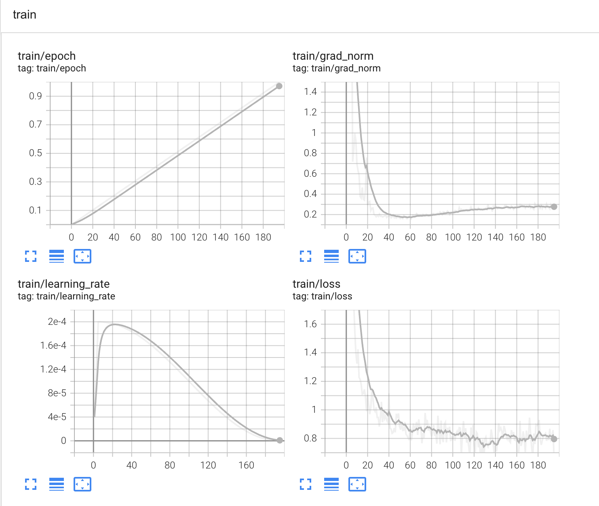

# Hyper-Sloth

A high-performance framework for fine-tuning large language models.

## Overview

HyperSloth is an extension of Unsloth for distributed training of Large Language Models across multiple GPUs. It focuses on efficient gradient synchronization using memory-mapped files for seamless communication between GPU processes.

## Features

- **Memory-mapped gradient synchronization**: Coordinate training across multiple GPUs without requiring NCCL/DDP
- **Efficient weight synchronization**: Ensure model consistency across all GPUs during training
- **Template fixes**: Custom tokenizer chat template fixes for proper handling of "think" tags
- **Customizable loss types**: Support for full sequence or response-only training

## Installation

```bash
# Clone the repository
pip install git+https://github.com/anhvth/HyperSloth.git
```

## Quick Start

### Train a model across multiple GPUs

```bash
hypersloth-cli train example_training_config.py
```
see 
## Performance Benchmarks

Hyper-Sloth demonstrates significant performance improvements over other popular fine-tuning frameworks.

### Training Time Comparison (4x RTX 4090)

| Framework    | Training Time | VRAM Peak Consumption |
|--------------|---------------|----------------------|
| Hyper-Sloth  | 19 minutes    | 6 GB                 |
| LlamaFactory | 30 minutes    | 21 GB                |
| Unsloth (1X) | ~70 minutes   | 6 GB                 |

### Loss Curves

The loss scale between Hyper-Sloth and LlamaFactory looks comparable, indicating similar training quality with significantly improved training speed.

| { width=150 } | { width=150 } |
|--------------------------------------------------------------------|--------------------------------------------------------------------|
| Hyper-Sloth Tensorboard[^1]                                        | LlamaFactory Tensorboard[^2]                                        |

[^1]: Hyper-Sloth Tensorboard visualization.
[^2]: LlamaFactory Tensorboard visualization.

## Configuration

Hyper-Sloth uses Pydantic models for configuration. See `hypersloth_config.py` for an example configuration.

## Getting Started

[Configuration instructions and usage examples will go here]

<p align="center">
    
</p>
